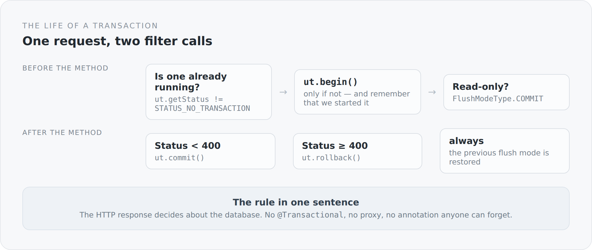

`@Transactional` is one of the most convenient annotations there is, and one of the most opaque. You write it on a method, and afterwards there is a transaction. Where it starts, when it commits, what happens when another method of the same class is called, what a checked exception does — all of that is the behaviour of a proxy you never see.

In this blog the annotation does not exist. There is a filter.

## The whole mechanism

```scala
@Provider
class QuarkusTransactionFilter extends ContainerRequestFilter with ContainerResponseFilter {

  override def filter(requestContext: ContainerRequestContext): Unit = {
    val ut = userTransaction
    val transactionActive = ut.getStatus != Status.STATUS_NO_TRANSACTION

    if (!transactionActive) {
      ut.begin()
      requestContext.setProperty(startedKey, java.lang.Boolean.TRUE)
    }

    requestContext.setProperty(flushModeKey, entityManager.getFlushMode)
    if (isReadOnly(requestContext)) {
      entityManager.setFlushMode(FlushModeType.COMMIT)
    }
  }

  override def filter(requestContext: ContainerRequestContext,
                      responseContext: ContainerResponseContext): Unit = {
    try {
      val ut = userTransaction
      if (wasStarted(requestContext) && ut.getStatus != Status.STATUS_NO_TRANSACTION) {
        if (responseContext.getStatus < 400) ut.commit() else ut.rollback()
      }
    } finally {
      Option(requestContext.getProperty(flushModeKey).asInstanceOf[FlushModeType])
        .foreach(entityManager.setFlushMode)
    }
  }
}
```

That is all. Before the resource method a transaction is opened, afterwards it is finished depending on the HTTP status.

{width=720}

## The one rule

The core sits in a single line:

```scala
if (responseContext.getStatus < 400) ut.commit() else ut.rollback()
```

The HTTP status decides about the database.

That is a stricter rule than the usual one. With `@Transactional` what decides is whether an exception was thrown — and usually only an unchecked one. A controller that catches an error and politely returns `Response.status(400)` would still commit in many systems. Not here.

I think that is right, because it matches the caller's expectation. Someone who receives a 400 assumes nothing happened. If something was written in the background anyway, that is a bug you only find weeks later in the data.

## The three details easy to miss

**The transaction is only opened when none is running**, and only the level that opened it closes it. That sounds trivial, but it is the difference between a filter that works once and one that also works when invoked nested — which does actually happen during server-side rendering.

**Read-only requests get `FlushModeType.COMMIT`.** By default Hibernate checks before every query whether the persistence context holds anything unwritten and writes it pre-emptively. On a `GET` there is nothing to write, so the check is pure work. The switch saves it.

**The previous flush mode is restored in the `finally`.** The `EntityManager` is request-scoped, but it may be used again within the same request. Changing global state and not restoring it is the kind of bug that only appears under load.

## What sits underneath

The filter itself would be pointless without the wiring from the previous article. For `UserTransaction` to mean anything, the connection pool has to be bound to the transaction manager:

```scala
val transactionIntegration = new NarayanaTransactionIntegration(
  transactionManager, transactionSynchronizationRegistry
)

val connectionFactoryConfig = new AgroalConnectionFactoryConfigurationSupplier()
  .connectionProviderClass(classOf[PGXADataSource])

val poolConfig = new AgroalConnectionPoolConfigurationSupplier()
  .transactionRequirement(TransactionRequirement.WARN)
  .connectionFactoryConfiguration(connectionFactoryConfig)
  .transactionIntegration(transactionIntegration)
```

Three things are explicit here that an application server would have decided for you.

`PGXADataSource` — the connections are XA-capable. For a blog with one database you strictly speaking do not need that. It costs a little, and it leaves the door open for a second resource.

`NarayanaTransactionIntegration` — the pool knows which connection belongs to which transaction. Without this line every `EntityManager` call could potentially get a different connection, and the transaction would be an illusion.

`TransactionRequirement.WARN` — if someone takes a connection without a running transaction, there is a warning in the log. Not an error, but not silence either. That is a compromise, and it is deliberate: during server-side rendering and in startup code there are legitimate accesses outside a request.

## What this approach cannot do

Staying honest here too.

**There is no finer-grained control.** A method that needed two independent transactions cannot express that with this mechanism. There is no `REQUIRES_NEW`. For this blog that is not a problem — for a system with workflows it would be one.

**The scope is the request, not the business operation.** Usually those are the same, but not always. A very long request keeps the transaction open for a very long time.

**And the name is wrong.** The class is called `QuarkusTransactionFilter`, although no Quarkus runs in this project. The name tells you where the idea came from. I already mentioned it as an outstanding debt in the article about the modules, and it is still there.

## Why I prefer it this way

Because I can answer the question "why was nothing committed here" in a single file.

With an annotation the answer is distributed: across the behaviour of the proxy, the configuration of the container, the question of whether the call even went through the proxy. With a filter it sits in thirty lines you can read in one go.

That is not an argument against `@Transactional` inside a product team. It is an argument that in a system you want to understand, this particular place should hold no magic.

The next article moves one layer up: to the place where those managed objects become JSON — and back again.
