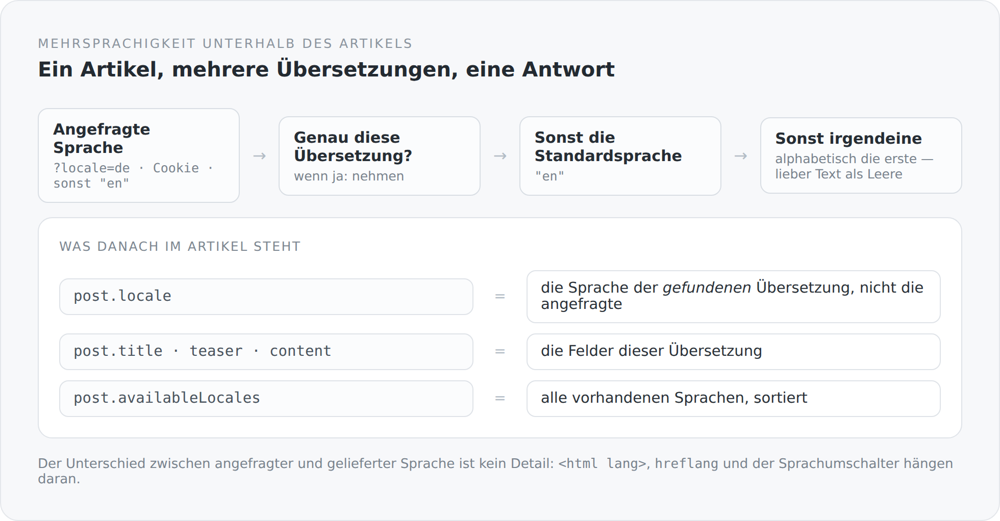

Es gibt zwei gängige Wege, einen Blog mehrsprachig zu machen. Der erste: Man legt jeden Artikel zweimal an und verlinkt die beiden Fassungen. Der zweite: Man hängt an jedes Textfeld eine Sprachvariante — `title_de`, `title_en` — und wählt beim Auslesen aus.

Der erste Weg verdoppelt alles, was nicht Text ist: Status, Veröffentlichungsdatum, Tags, Kommentare, Titelbild. Der zweite skaliert nicht über zwei Sprachen hinaus und macht jedes Schema hässlich.

Dieser Blog geht einen dritten Weg: Der Artikel ist eins, seine sprachlichen Ausprägungen sind eine eigene Entität.

## Die Aufteilung

Am Artikel hängt alles, was sprachunabhängig ist: Slug, Status, Veröffentlichungsdatum, Autor, Tags, Titelbild, Kommentare, ob die Diskussion offen ist.

An der Übersetzung hängt, was sprachabhängig ist:

```scala
@Entity
@Table(name = "Blog#Post#Translation",
  uniqueConstraints = Array(new UniqueConstraint(columnNames = Array("post_id", "locale"))))
class BlogPostTranslation extends AbstractEntity, EntityContext[BlogPostTranslation], OwnerProvider {

  @ManyToOne(optional = false, fetch = FetchType.LAZY)
  @JoinColumn(name = "post_id", nullable = false)
  var post: BlogPost = uninitialized

  @NotBlank @Size(min = 2, max = 12)
  var locale: String = BlogPost.DefaultLocale

  @NotBlank @Size(min = 3, max = 180)
  var title: String = uninitialized

  @Size(max = 500)
  var teaser: String = uninitialized

  @NotNull @Type(value = classOf[LexicalDocumentType])
  var content: LexicalDocument = uninitialized
}
```

Der `UniqueConstraint` auf `(post_id, locale)` ist die wichtigste Zeile. Er macht aus einer Absicht eine Zusicherung: Ein Artikel hat pro Sprache höchstens eine Fassung. Nicht als Prüfung in einem Service, die man umgehen kann, sondern als Regel in der Datenbank.

Und `owner()` verweist weiter:

```scala
override def owner(): EntityProvider = if (post == null) null else post.author
```

Die Übersetzung hat keinen eigenen Besitzer. Wem der Artikel gehört, dem gehören seine Übersetzungen. Eine Zeile, und die Berechtigungsfrage für eine ganze Entität ist beantwortet.

## Die Auswahl

Wenn jemand einen Artikel auf Deutsch anfragt, es ihn aber nur auf Englisch gibt — was dann?

{width=720}

```scala
private[blog] def selectForView[A](translations: Iterable[A], requestedLocale: String)
                                  (localeOf: A => String): Option[A] = {
  val normalizedLocale = normalizeLocale(requestedLocale)
  def matching(locale: String): Option[A] =
    translations.find(value => normalizeLocale(localeOf(value)) == locale)

  matching(normalizedLocale)
    .orElse(matching(BlogPost.DefaultLocale))
    .orElse(translations.toSeq.sortBy(value => Option(localeOf(value)).getOrElse("")).headOption)
}
```

Drei Stufen: die angefragte Sprache, dann die Standardsprache, dann irgendeine — sortiert, damit die Auswahl deterministisch ist.

Die dritte Stufe ist die interessante. Sie sagt: Lieber ein Artikel in einer Sprache, die der Leser nicht erwartet hat, als eine leere Seite. Für einen Blog ist das richtig; für ein System mit rechtlich relevanten Texten wäre es falsch. Es ist eine fachliche Entscheidung, und sie steht in einer Zeile, die man ändern kann.

Auffällig ist auch die Signatur: `selectForView` nimmt eine beliebige Sammlung und eine Funktion, die daraus die Sprache liest. Es kennt `BlogPostTranslation` nicht. Damit funktioniert dieselbe Regel auch für andere übersetzbare Dinge — im Projekt zum Beispiel für Tags mit `nameDe` und `nameEn`.

## Die Projektion

Nach der Auswahl werden die Felder in den Artikel hineingeschrieben:

```scala
selected match {
  case Some(translation) =>
    // The response locale describes the content that was actually selected,
    // not merely the requested UI/query locale.
    post.locale = normalizeLocale(translation.locale)
    post.title = translation.title
    post.teaser = translation.teaser
    post.content = translation.content

  case None =>
    post.locale = normalizedLocale
    post.title = ""
    post.teaser = null
    post.content = null
}
```

Der Kommentar im Code markiert genau die Stelle, an der die meisten mehrsprachigen Systeme falsch liegen.

`post.locale` ist nicht die angefragte Sprache. Es ist die Sprache des Textes, den der Leser tatsächlich bekommt.

Der Unterschied ist keine Feinheit. Er entscheidet über das `lang`-Attribut im HTML, über `hreflang`, über die Frage, welche Sprachumschalter aktiv aussehen — und darüber, ob eine Suchmaschine einen englischen Text für einen deutschen hält. Ein Blog, der bei `/de/blog/...` ein `<html lang="de">` mit englischem Text ausliefert, gibt Suchmaschinen eine falsche Auskunft.

Daneben wird gefüllt, was der Umschalter braucht:

```scala
post.availableLocales.clear()
availableLocales(post).foreach(post.availableLocales.add)
```

Alle vorhandenen Sprachen, normalisiert, ohne Duplikate, sortiert. Der Client muss nicht raten, welche Fassungen es gibt.

## Zwei Projektionen, ein Unterschied

```scala
def projectForView(post: BlogPost, requestedLocale: String): Unit =
  project(post, normalizeLocale(requestedLocale), fallback = true)

def projectForEdit(post: BlogPost, requestedLocale: String): Unit =
  project(post, normalizeLocale(requestedLocale), fallback = false)
```

Beim Lesen wird ausgewichen, beim Bearbeiten nicht.

Der Grund ist offensichtlich, sobald man ihn einmal falsch gemacht hat. Wer die deutsche Fassung bearbeiten will und ersatzweise die englische bekommt, überschreibt beim Speichern die deutsche mit englischem Text. Der Fallback, der beim Lesen freundlich ist, ist beim Schreiben ein Datenverlust.

Zwei Methoden, ein Boolean Unterschied — und der Unterschied hat einen Namen, den man in der Aufrufstelle lesen kann.

## Der Rückweg

Beim Speichern muss die Projektion wieder aufgelöst werden:

```scala
val translation = translationFor(post, locale).getOrElse {
  val value = new BlogPostTranslation
  value.post = post
  value.locale = locale
  post.translations.add(value)
  value
}

if (post.title != null) translation.title = post.title
if (post.teaser != null) translation.teaser = post.teaser
if (post.content != null) translation.content = post.content
```

Existiert die Übersetzung noch nicht, entsteht sie. Und geschrieben wird nur, was gesetzt ist — ein `null` löscht nichts.

Damit ist eine neue Sprache kein eigener Vorgang. Man wählt sie im Editor, schreibt, speichert. Die Übersetzung entsteht dabei.

## Woher die Sprache kommt

```scala
@RequestScoped
class BlogPostLocaleResolver {
  def resolve(): String = {
    val requested = Option(request)
      .flatMap(value => Option(value.getParameter("locale")))
      .orElse(readLocaleCookie())
    BlogPostLocalization.normalizeLocale(requested.orNull)
  }
}
```

Erst der Query-Parameter, dann ein Cookie, sonst die Standardsprache. Und `normalizeLocale` lässt genau zwei Werte durch:

```scala
def normalizeLocale(raw: String): String =
  Option(raw).map(_.trim.toLowerCase).filter(_.nonEmpty)
    .collect { case "de" => "de"; case "en" => "en" }
    .getOrElse(BlogPost.DefaultLocale)
```

Alles andere wird `en`. Kein `de-DE`, kein `en-US`, keine Verhandlung über Qualitätswerte. Das ist bewusst klein gehalten: Zwei Sprachen, zwei erlaubte Werte, keine Zwischenzustände.

Erweitern hieße, diese eine Funktion zu ändern. Bis dahin gibt es im ganzen System keinen Ort, an dem ein unbekanntes Sprachkürzel Schaden anrichten kann.

## Was fehlt

Ehrlich: Der `Accept-Language`-Header des Browsers wird für die Auswahl der Artikelsprache nicht ausgewertet. Er wird zwar an das serverseitige Rendering durchgereicht, aber der Resolver kennt nur Parameter und Cookie. Ein deutscher Leser, der `/blog/...` ohne Präfix aufruft, bekommt Englisch, bis er einmal umschaltet.

Das ist keine Nachlässigkeit, sondern eine offene Entscheidung: Automatische Spracherkennung und stabile, indexierbare URLs vertragen sich schlecht. Aber es steht auf der Liste, und es steht hier, statt in einer Fußnote.

Im nächsten Artikel bekommt derselbe Text eine zweite Existenz — als Datei in einem Repository.
