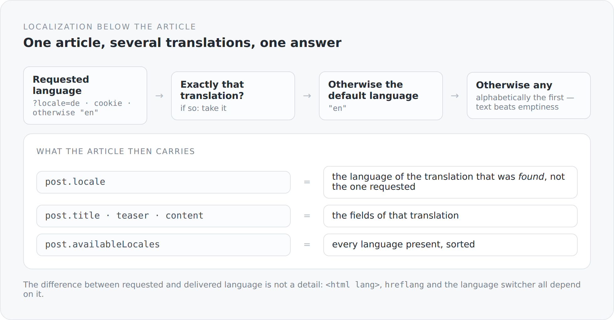

There are two common ways to make a blog multilingual. The first: create every article twice and link the two versions. The second: attach a language variant to every text field — `title_de`, `title_en` — and pick when reading.

The first duplicates everything that is not text: status, publication date, tags, comments, cover image. The second does not scale past two languages and makes every schema ugly.

This blog takes a third route: the article is one thing, its linguistic manifestations are an entity of their own.

## The split

Everything language-independent hangs on the article: slug, status, publication date, author, tags, cover image, comments, whether the discussion is open.

Everything language-dependent hangs on the translation:

```scala
@Entity
@Table(name = "Blog#Post#Translation",
  uniqueConstraints = Array(new UniqueConstraint(columnNames = Array("post_id", "locale"))))
class BlogPostTranslation extends AbstractEntity, EntityContext[BlogPostTranslation], OwnerProvider {

  @ManyToOne(optional = false, fetch = FetchType.LAZY)
  @JoinColumn(name = "post_id", nullable = false)
  var post: BlogPost = uninitialized

  @NotBlank @Size(min = 2, max = 12)
  var locale: String = BlogPost.DefaultLocale

  @NotBlank @Size(min = 3, max = 180)
  var title: String = uninitialized

  @Size(max = 500)
  var teaser: String = uninitialized

  @NotNull @Type(value = classOf[LexicalDocumentType])
  var content: LexicalDocument = uninitialized
}
```

The `UniqueConstraint` on `(post_id, locale)` is the most important line. It turns an intention into a guarantee: an article has at most one version per language. Not as a check in a service you can bypass, but as a rule in the database.

And `owner()` delegates:

```scala
override def owner(): EntityProvider = if (post == null) null else post.author
```

The translation has no owner of its own. Whoever owns the article owns its translations. One line, and the authorization question for an entire entity is answered.

## The selection

When someone asks for an article in German but it only exists in English — then what?

{width=720}

```scala
private[blog] def selectForView[A](translations: Iterable[A], requestedLocale: String)
                                  (localeOf: A => String): Option[A] = {
  val normalizedLocale = normalizeLocale(requestedLocale)
  def matching(locale: String): Option[A] =
    translations.find(value => normalizeLocale(localeOf(value)) == locale)

  matching(normalizedLocale)
    .orElse(matching(BlogPost.DefaultLocale))
    .orElse(translations.toSeq.sortBy(value => Option(localeOf(value)).getOrElse("")).headOption)
}
```

Three steps: the requested language, then the default language, then any of them — sorted, so the choice is deterministic.

The third step is the interesting one. It says: better an article in a language the reader did not expect than an empty page. For a blog that is right; for a system with legally relevant texts it would be wrong. It is a domain decision, and it sits in one line you can change.

Note also the signature: `selectForView` takes any collection and a function that reads the language out of it. It does not know `BlogPostTranslation`. The same rule therefore works for other translatable things — in this project, for instance, for tags with `nameDe` and `nameEn`.

## The projection

After the selection the fields are written into the article:

```scala
selected match {
  case Some(translation) =>
    // The response locale describes the content that was actually selected,
    // not merely the requested UI/query locale.
    post.locale = normalizeLocale(translation.locale)
    post.title = translation.title
    post.teaser = translation.teaser
    post.content = translation.content

  case None =>
    post.locale = normalizedLocale
    post.title = ""
    post.teaser = null
    post.content = null
}
```

The comment in the code marks exactly the place where most multilingual systems get it wrong.

`post.locale` is not the requested language. It is the language of the text the reader actually receives.

The difference is not a subtlety. It determines the `lang` attribute in the HTML, `hreflang`, which language switcher appears active — and whether a search engine takes an English text for a German one. A blog that serves `<html lang="de">` with English text at `/de/blog/...` is giving search engines false information.

Alongside it, what the switcher needs gets filled in:

```scala
post.availableLocales.clear()
availableLocales(post).foreach(post.availableLocales.add)
```

Every present language, normalized, deduplicated, sorted. The client does not have to guess which versions exist.

## Two projections, one difference

```scala
def projectForView(post: BlogPost, requestedLocale: String): Unit =
  project(post, normalizeLocale(requestedLocale), fallback = true)

def projectForEdit(post: BlogPost, requestedLocale: String): Unit =
  project(post, normalizeLocale(requestedLocale), fallback = false)
```

Reading falls back, editing does not.

The reason is obvious the moment you have got it wrong once. If you want to edit the German version and are handed the English one instead, saving overwrites the German text with English. The fallback that is friendly when reading is data loss when writing.

Two methods, one boolean apart — and the difference has a name you can read at the call site.

## The way back

When saving, the projection has to be undone:

```scala
val translation = translationFor(post, locale).getOrElse {
  val value = new BlogPostTranslation
  value.post = post
  value.locale = locale
  post.translations.add(value)
  value
}

if (post.title != null) translation.title = post.title
if (post.teaser != null) translation.teaser = post.teaser
if (post.content != null) translation.content = post.content
```

If the translation does not exist yet, it comes into being. And only what is set gets written — a `null` deletes nothing.

A new language is therefore not a separate operation. You pick it in the editor, write, save. The translation appears along the way.

## Where the language comes from

```scala
@RequestScoped
class BlogPostLocaleResolver {
  def resolve(): String = {
    val requested = Option(request)
      .flatMap(value => Option(value.getParameter("locale")))
      .orElse(readLocaleCookie())
    BlogPostLocalization.normalizeLocale(requested.orNull)
  }
}
```

The query parameter first, then a cookie, otherwise the default language. And `normalizeLocale` lets exactly two values through:

```scala
def normalizeLocale(raw: String): String =
  Option(raw).map(_.trim.toLowerCase).filter(_.nonEmpty)
    .collect { case "de" => "de"; case "en" => "en" }
    .getOrElse(BlogPost.DefaultLocale)
```

Everything else becomes `en`. No `de-DE`, no `en-US`, no negotiation over quality values. That is deliberately kept small: two languages, two permitted values, no in-between states.

Extending would mean changing this one function. Until then there is no place in the system where an unknown language code can do damage.

## What is missing

Honestly: the browser's `Accept-Language` header is not evaluated when choosing the article language. It is passed through to server-side rendering, but the resolver only knows parameter and cookie. A German reader opening `/blog/...` without a prefix gets English until they switch once.

That is not negligence but an open decision: automatic language detection and stable, indexable URLs do not go well together. But it is on the list, and it is here instead of in a footnote.

In the next article the same text gets a second existence — as a file in a repository.
