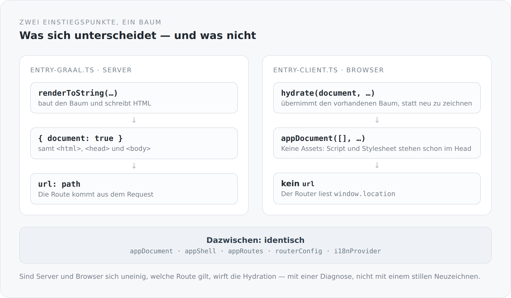

Der ganze Aufwand der letzten Artikel läuft auf eine einzige Stelle zu: die Naht zwischen Server und Browser. Sie besteht aus zwei Dateien, zusammen unter hundert Zeilen.

## Der Server

```ts
export async function render(
  path: string,
  assets: readonly HeadEntry[] = [],
  applicationPayload: unknown = null,
  publicOrigin = ""
): Promise<{ html: string; status: number }> {
  configureRequestUrls(path, publicOrigin);
  const application = normalizeApplication(applicationPayload);
  const result = await renderToString(
    () =>
      i18nProvider(providerConfig(path), () =>
        appDocument(
          assets,
          () => appShell(appRoutes, { ...routerConfig, url: path }, application),
          path,
          applicationPayload,
        )
      ),
    { document: true }
  );
  return { html: `<!doctype html>${result.html}`, status: result.status };
}
```

Eine Funktion, ein Pfad hinein, HTML und ein Status heraus.

`{ document: true }` ist wichtiger, als es aussieht: Gerendert wird das ganze Dokument, nicht nur ein Ausschnitt für ein `<div id="root">`. `<html>`, `<head>` mit Titel, Beschreibung, Canonical und Sprachattribut, `<body>` mit dem Inhalt. Der Server liefert eine vollständige Seite, keine Hülle.

Und `result.status`. Eine Route mit `status: 404` aus dem Katalog liefert einen echten HTTP-404 aus, weil der Renderer den Status zurückgibt und der Undertow-Handler ihn setzt.

## Der Browser

```ts
const application = await initialApplication();

await hydrate(document, () =>
  i18nProvider(providerConfig(), () =>
    appDocument([], () => appShell(appRoutes, routerConfig, application.state), "/", application.payload)
  )
);

hydratedProperty().set(true);
```

Fast dieselben Zeilen. Drei Unterschiede.

`hydrate(document, ...)` statt `renderToString`. Der Baum wird nicht gezeichnet, sondern übernommen — die vorhandenen DOM-Knoten bekommen ihre Bindungen, ihre Ereignisbehandlung und ihren Zustand.

{width=720}

`appDocument([], ...)` — leere Asset-Liste. Der Kommentar erklärt es:

> `assets` is empty: the bundle's own script/stylesheet tags are already in the server-rendered head and are not re-registered here -- the browser head sink leaves server-rendered entries it never managed alone.

Ein zweites Registrieren würde die Tags entweder verdoppeln oder — schlimmer — beim ersten Abbau entfernen, obwohl sie noch gebraucht werden.

Und kein `url`: Im Browser liest der Router `window.location`.

## Zwischen den beiden: identisch

`appDocument`, `appShell`, `appRoutes`, `routerConfig`, `i18nProvider`. Dieselben Module, dieselben Funktionen, derselbe Code.

Das ist der Zweck der ganzen Konstruktion. Es gibt keine serverseitige Fassung einer Seite und keine clientseitige. Es gibt eine Seite, und zwei Einstiegspunkte, die sie unterschiedlich in Gang setzen.

## Was passiert, wenn beide sich uneinig sind

```ts
// A hydration fault throws here with HydratingCursor's diagnostic
// (JAVASCRIPT_API.md §11) if server and client ever disagree on the matched route.
```

Kein stilles Neuzeichnen. Ein Fehler mit einer Diagnose.

Das ist die richtige Entscheidung, auch wenn sie unangenehm ist. Ein Framework, das bei einer Abweichung einfach neu zeichnet, versteckt genau den Fehler, den man finden will: dass Server und Browser dieselbe Adresse verschieden interpretieren. Man sieht ein Flackern, sucht drei Tage lang die Ursache und findet sie nicht.

Es gibt eine Menge Gründe, warum die beiden sich uneinig sein können — eine Route, die von der Uhrzeit abhängt, ein Zustand, der nur auf einer Seite existiert, eine Sprache, die unterschiedlich aufgelöst wird. Jeder davon ist ein echter Fehler, und jeder soll sich melden.

## Der Zustand, der beide verbindet

```ts
const application = await initialApplication();
```

Auf der Serverseite entspricht dem der Parameter `applicationPayload`, den der Renderer bekommt. Und der Server holt ihn sich vorher selbst:

```scala
val builder = HttpRequest.newBuilder()
  .uri(URI.create(s"${apiOrigin.stripSuffix("/")}/service/"))
  .header("Accept", "application/json")
  .GET()
cookie.filter(_.nonEmpty).foreach(value => builder.header("Cookie", value))
acceptLanguage.filter(_.nonEmpty).foreach(value => builder.header("Accept-Language", value))
```

Der JVM-Prozess ruft seine eigene REST-Schnittstelle auf — mit dem Cookie und dem `Accept-Language` des ursprünglichen Besuchers. Damit sieht das serverseitige Rendering dieselbe Sitzung wie der Browser: Wer angemeldet ist, bekommt schon im ersten HTML die Ansicht eines Angemeldeten.

Und wenn dieser Aufruf fehlschlägt:

```scala
catch {
  case NonFatal(error) =>
    System.err.println(s"Could not load SSR application state: ${error.getMessage}")
    "null"
}
```

`"null"` statt eines Fehlers. Der Zustand ist eine Verbesserung, keine Voraussetzung. Ohne ihn wird die Seite als anonym gerendert, und der Browser korrigiert das nach der Hydration. Eine Seite mit weniger Vorwissen ist besser als keine Seite.

## Die letzte Zeile

```ts
hydratedProperty().set(true);
```

Erst wenn die Hydration vollständig durch ist, wird diese Eigenschaft gesetzt.

Sie ist für Dinge, die es serverseitig nicht geben kann und die vor der Hydration nicht laufen dürfen — alles, was `window`, Messungen oder Browserspeicher braucht. Statt überall `typeof window !== "undefined"` zu prüfen, gibt es einen Wert, den man beobachten kann.

Das ist wieder dasselbe Muster wie beim Lebenszyklus und beim Principal: Statt an vielen Stellen einen Sonderfall zu prüfen, gibt es an einer Stelle einen Wert, der die Antwort trägt.

## Warum diese Naht die interessanteste Stelle ist

Weil hier alle Entscheidungen dieser Reihe zusammenkommen.

Der Katalog, weil beide Seiten dieselbe Routentabelle brauchen. Der Lebenszyklus, weil auch das serverseitige Rendering Abonnements aufbaut und wieder abbaut. Der Link-folgende Client, weil er in beiden Laufzeiten funktionieren muss. Die Sprachauflösung, weil sie an beiden Orten dasselbe Ergebnis liefern muss. GraalVM, weil ohne sie nichts davon in einem Prozess laufen würde.

Wenn eine dieser Entscheidungen anders ausgefallen wäre, würde diese Naht nicht so schmal ausfallen. Und eine breite Naht zwischen Server und Browser ist der Ort, an dem in solchen Systemen die meisten Fehler wohnen.

Im nächsten Artikel geht es um das, was auf der JVM-Seite passiert, damit diese Funktion überhaupt aufrufbar ist.
