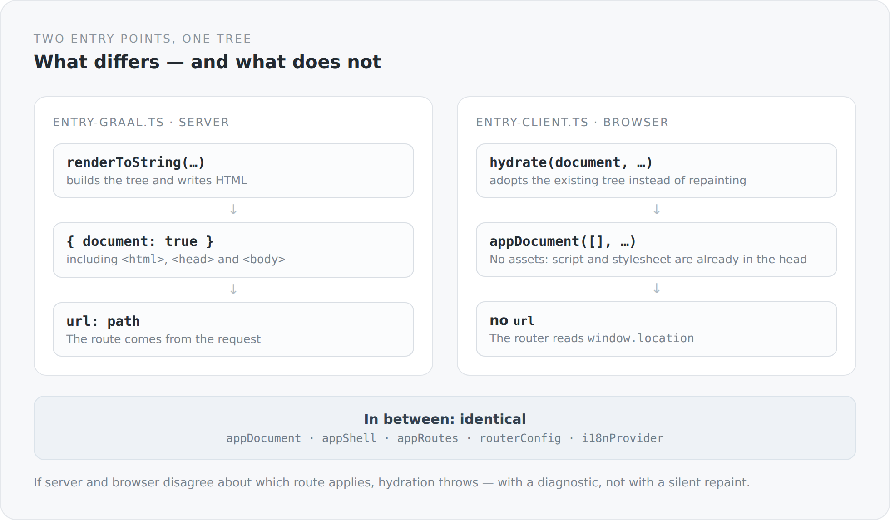

All the effort of the previous articles converges on a single place: the seam between server and browser. It consists of two files, under a hundred lines together.

## The server

```ts
export async function render(
  path: string,
  assets: readonly HeadEntry[] = [],
  applicationPayload: unknown = null,
  publicOrigin = ""
): Promise<{ html: string; status: number }> {
  configureRequestUrls(path, publicOrigin);
  const application = normalizeApplication(applicationPayload);
  const result = await renderToString(
    () =>
      i18nProvider(providerConfig(path), () =>
        appDocument(
          assets,
          () => appShell(appRoutes, { ...routerConfig, url: path }, application),
          path,
          applicationPayload,
        )
      ),
    { document: true }
  );
  return { html: `<!doctype html>${result.html}`, status: result.status };
}
```

One function, a path in, HTML and a status out.

`{ document: true }` matters more than it looks: what gets rendered is the whole document, not just a fragment for a `<div id="root">`. `<html>`, `<head>` with title, description, canonical and language attribute, `<body>` with the content. The server delivers a complete page, not a shell.

And `result.status`. A route with `status: 404` from the catalog produces a real HTTP 404, because the renderer returns the status and the Undertow handler sets it.

## The browser

```ts
const application = await initialApplication();

await hydrate(document, () =>
  i18nProvider(providerConfig(), () =>
    appDocument([], () => appShell(appRoutes, routerConfig, application.state), "/", application.payload)
  )
);

hydratedProperty().set(true);
```

Almost the same lines. Three differences.

`hydrate(document, ...)` instead of `renderToString`. The tree is not painted but adopted — the existing DOM nodes get their bindings, their event handling and their state.

{width=720}

`appDocument([], ...)` — an empty asset list. The comment explains it:

> `assets` is empty: the bundle's own script/stylesheet tags are already in the server-rendered head and are not re-registered here -- the browser head sink leaves server-rendered entries it never managed alone.

Registering a second time would either duplicate the tags or — worse — remove them on the first teardown, while they are still needed.

And no `url`: in the browser the router reads `window.location`.

## In between: identical

`appDocument`, `appShell`, `appRoutes`, `routerConfig`, `i18nProvider`. The same modules, the same functions, the same code.

That is the purpose of the whole construction. There is no server-side version of a page and no client-side one. There is a page, and two entry points that set it in motion differently.

## What happens when the two disagree

```ts
// A hydration fault throws here with HydratingCursor's diagnostic
// (JAVASCRIPT_API.md §11) if server and client ever disagree on the matched route.
```

No silent repaint. An error with a diagnostic.

That is the right decision, even though it is uncomfortable. A framework that simply repaints on a mismatch hides exactly the bug you want to find: that server and browser interpret the same address differently. You see a flicker, spend three days looking for the cause, and do not find it.

There are plenty of reasons the two could disagree — a route depending on the time of day, state that exists only on one side, a language resolved differently. Every one of them is a real bug, and every one should announce itself.

## The state that connects both

```ts
const application = await initialApplication();
```

On the server side that corresponds to the `applicationPayload` the renderer receives. And the server fetches it itself beforehand:

```scala
val builder = HttpRequest.newBuilder()
  .uri(URI.create(s"${apiOrigin.stripSuffix("/")}/service/"))
  .header("Accept", "application/json")
  .GET()
cookie.filter(_.nonEmpty).foreach(value => builder.header("Cookie", value))
acceptLanguage.filter(_.nonEmpty).foreach(value => builder.header("Accept-Language", value))
```

The JVM process calls its own REST interface — with the original visitor's cookie and `Accept-Language`. Server-side rendering therefore sees the same session as the browser: somebody signed in gets the signed-in view already in the first HTML.

And when that call fails:

```scala
catch {
  case NonFatal(error) =>
    System.err.println(s"Could not load SSR application state: ${error.getMessage}")
    "null"
}
```

`"null"` instead of an error. The state is an improvement, not a precondition. Without it the page is rendered as anonymous, and the browser corrects that after hydration. A page with less prior knowledge is better than no page.

## The last line

```ts
hydratedProperty().set(true);
```

Only once hydration has fully settled is this property set.

It exists for things that cannot exist on the server and must not run before hydration — anything needing `window`, measurements or browser storage. Instead of checking `typeof window !== "undefined"` everywhere, there is a value you can observe.

That is again the same pattern as with the lifecycle and the principal: instead of checking a special case in many places, there is one place holding a value that carries the answer.

## Why this seam is the most interesting part

Because every decision of this series comes together here.

The catalog, because both sides need the same route table. The lifecycle, because server-side rendering also builds and tears down subscriptions. The link-following client, because it has to work in both runtimes. Language resolution, because it has to yield the same result in both places. GraalVM, because without it none of this would run in one process.

Had any one of those decisions gone differently, this seam would not be this narrow. And a wide seam between server and browser is where most of the bugs live in systems like this.

The next article is about what happens on the JVM side so that this function is callable at all.
