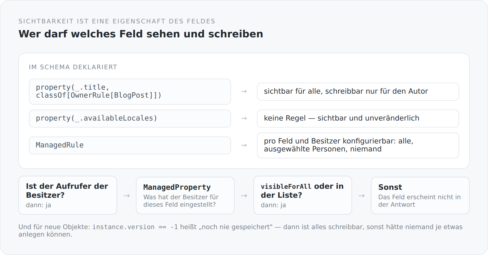

In fast jedem System, das ich kenne, sieht Berechtigungslogik so aus:

```scala
if (currentUser.isAdmin || currentUser.id == post.author.id) {
  // Feld ausgeben
}
```

Das ist nicht falsch. Es ist nur an der falschen Stelle. Die Aussage „diesen Titel darf nur der Autor ändern" gehört zum Titel, nicht zu der Methode, die ihn gerade zufällig anfasst. Sobald es einen zweiten Ort gibt, an dem dasselbe Feld ausgegeben wird, gibt es zwei Kopien der Regel — und ab dem dritten Ort gibt es einen Fehler.

## Die Regel steht am Feld

```scala
class Schema extends AbstractEntitySchema[BlogPost](RuntimeContext.entityManager()) {
  val title: Property[BlogPost, String] =
    property(_.title, classOf[OwnerRule[BlogPost]])
  val status: Property[BlogPost, BlogPostStatus] =
    property(_.status, classOf[OwnerRule[BlogPost]])
  val availableLocales: Property[BlogPost, util.List[String]] =
    property(_.availableLocales)
  val tags: SetProperty[BlogPost, util.Set[BlogTag]] =
    set(_.tags, classOf[OwnerRule[BlogPost]])
}
```

Jede Zeile ist eine Aussage über ein Feld. `title` hängt an einer Regel, `availableLocales` nicht. Man liest die Berechtigungsstruktur eines Artikels, indem man diese fünfzehn Zeilen liest.

{width=720}

## Die einfache Regel

```scala
class OwnerRule[E <: OwnerProvider & EntityProvider](val holder: CurrentIdentity)
  extends VisibilityRule[E] {

  override def isVisible(instance: E, property: AbstractProperty): Boolean = true

  override def isWriteable(instance: E, property: AbstractProperty): Boolean = {
    if (instance.version == -1L) true
    else holder.isAuthenticated && holder.user != null && holder.user.id == instance.owner().id
  }
}
```

Sichtbar für alle, schreibbar nur für den Besitzer. Für einen Blog ist das die richtige Voreinstellung — Artikel sind öffentlich, ihre Bearbeitung ist es nicht.

Die erste Zeile von `isWriteable` ist die, die man beim ersten Lesen übersieht und ohne die nichts funktioniert. `version == -1` heißt „dieses Objekt wurde noch nie gespeichert". Ein neues Objekt hat noch keinen Besitzer, und ohne diesen Fall könnte niemand jemals etwas anlegen: Die Regel würde beim Erzeugen greifen, obwohl es noch nichts gibt, dem man gehören könnte.

Das ist die Art von Sonderfall, die man in einem generischen Mechanismus haben *muss* und die man am besten sofort sichtbar an den Anfang schreibt.

## Die konfigurierbare Regel

`ManagedRule` geht weiter. Hier entscheidet nicht der Code, sondern der Besitzer der Daten:

```scala
override def isVisible(instance: E, property: AbstractProperty): Boolean = {
  if (instance == null) return false
  if (!holder.isAuthenticated || holder.user == null) return false

  val ownerId = instance.owner().id
  if (ownerId == null) return false
  if (holder.user.id == ownerId) return true

  val managedProperty = visibilityContext.managedProperty(
    ownerId, property.name,
    bootstrapService.findOrCreateManagedProperty(ownerId, property.name))
  if (managedProperty == null) return false

  if (managedProperty.visibleForAll) return true
  if (managedProperty.users.stream().anyMatch(user => user.id == holder.user.id)) return true

  true
}
```

Der Ablauf ist eine Kette von Abbrüchen, und jede Zeile ist ein Satz: Kein Objekt — nein. Nicht angemeldet — nein. Kein Besitzer — nein. Du bist der Besitzer — ja. Sonst: Was hat der Besitzer für dieses Feld eingestellt?

Ein `ManagedProperty` ist eine Zeile in der Datenbank, pro Besitzer und pro Feldname. Sie sagt: für alle sichtbar, für diese Personen sichtbar, oder für niemanden. Das ist die Datenstruktur hinter einer Privatsphäre-Einstellung, wie man sie aus sozialen Netzwerken kennt — hier für ein Blog vielleicht überdimensioniert, aber der Mechanismus ist da.

`findOrCreateManagedProperty` legt fehlende Einträge an. Neue Felder haben also automatisch eine Einstellung, statt in einen undefinierten Zustand zu fallen.

## Und ein Fehler, den ich hier stehen lasse

Die letzte Zeile dieser Methode ist ein `true`.

Nach `visibleForAll`, nach der Personenliste — wenn beides nicht zutrifft, gibt die Methode trotzdem `true` zurück. Ein Feld, das der Besitzer weder für alle noch für ausgewählte Personen freigegeben hat, ist damit sichtbar.

Das ist eine Sichtbarkeitsregel, die im Zweifel öffnet statt zu schließen. Für ein System, in dem `ManagedRule` tatsächlich Privatsphäre-Einstellungen durchsetzt, wäre das der falsche Standard.

Ich weiß, wie es dazu kam: Zwischen der Personenprüfung und dem Ende stehen ein paar Zeilen Zeitmessung, die dort nicht hingehören, und das `return false` ist beim Einbauen dieser Messung verloren gegangen. Man sieht es dem Code an, wenn man ihn ganz liest:

```scala
val totalEnd = System.nanoTime()
val totalMs = (totalEnd - totalStart) / 1000000.0
if (totalMs > 1.0) { log.info(...) }
true
```

Genau diese Art von Vermischung — eine Entscheidung und eine Messung in derselben Methode — ist der Grund, warum Zeitmessung an einer eigenen Stelle gehört. Der Artikel über den Performance-Interceptor hat beschrieben, wie es richtig geht; diese Methode ist der Gegenbeweis in eigener Sache.

`ManagedRule` wird im Blog derzeit nirgends verwendet — überall steht `OwnerRule`. Der Fehler ist also folgenlos. Er steht trotzdem hier, weil eine Reihe über die eigene Architektur wenig wert ist, wenn sie an den unangenehmen Stellen aufhört.

## Was der Mechanismus möglich macht

Weil die Regel am Feld hängt und nicht am Aufrufer, gilt sie überall gleichzeitig.

Sie gilt beim Serialisieren: Ein Feld, das nicht sichtbar ist, steht nicht in der Antwort. Sie gilt beim Deserialisieren: Ein Feld, das nicht schreibbar ist, wird aus dem eingehenden JSON nicht übernommen — ein Client kann also nicht einfach `status: PUBLISHED` mitschicken und darauf hoffen. Und sie gilt im Schema: Das Formular weiß, welche Felder es anzeigen darf.

Drei Wirkungen, eine Deklaration. Das ist der eigentliche Gewinn — nicht die Regel selbst, sondern dass sie nur einmal existiert.

## Der Preis

**Es ist indirekt.** Wer wissen will, warum ein Feld fehlt, muss den Weg über Schema, Regel und `CurrentIdentity` gehen. Ein `if` im Controller wäre schneller zu lesen.

**Es kostet Zeit pro Feld.** `ManagedRule` fragt im ungünstigen Fall die Datenbank. Dass die Methode selbst eine Zeitmessung enthält, zeigt, dass mich das beschäftigt hat.

**Und Reflexion bleibt Reflexion.** `AbstractProperty`, Typparameter zur Laufzeit, generische Regeln. Wenn es schiefgeht, geht es an einer Stelle schief, an der kein Stacktrace mehr fachlich spricht.

Im nächsten Artikel wird es konkreter: Kommentare sind die einzige Stelle, an der Fremde in diesen Blog hineinschreiben — und damit die einzige, an der diese Regeln wirklich unter Druck stehen.
