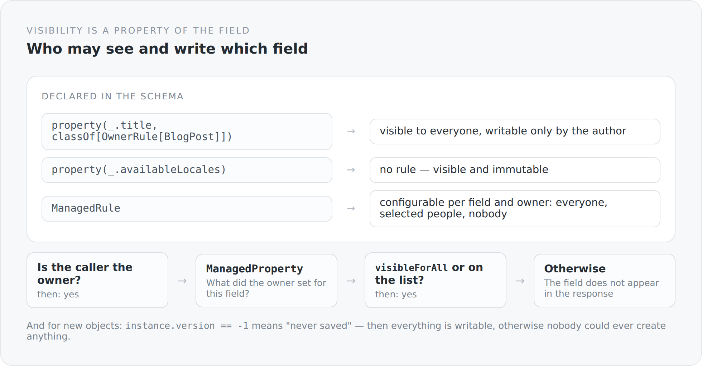

In almost every system I know, authorization logic looks like this:

```scala
if (currentUser.isAdmin || currentUser.id == post.author.id) {
  // output the field
}
```

That is not wrong. It is only in the wrong place. The statement "only the author may change this title" belongs to the title, not to the method that happens to be touching it right now. As soon as there is a second place where the same field is output, there are two copies of the rule — and from the third place on, there is a bug.

## The rule lives on the field

```scala
class Schema extends AbstractEntitySchema[BlogPost](RuntimeContext.entityManager()) {
  val title: Property[BlogPost, String] =
    property(_.title, classOf[OwnerRule[BlogPost]])
  val status: Property[BlogPost, BlogPostStatus] =
    property(_.status, classOf[OwnerRule[BlogPost]])
  val availableLocales: Property[BlogPost, util.List[String]] =
    property(_.availableLocales)
  val tags: SetProperty[BlogPost, util.Set[BlogTag]] =
    set(_.tags, classOf[OwnerRule[BlogPost]])
}
```

Every line is a statement about a field. `title` hangs on a rule, `availableLocales` does not. You read the permission structure of an article by reading those fifteen lines.

{width=720}

## The simple rule

```scala
class OwnerRule[E <: OwnerProvider & EntityProvider](val holder: CurrentIdentity)
  extends VisibilityRule[E] {

  override def isVisible(instance: E, property: AbstractProperty): Boolean = true

  override def isWriteable(instance: E, property: AbstractProperty): Boolean = {
    if (instance.version == -1L) true
    else holder.isAuthenticated && holder.user != null && holder.user.id == instance.owner().id
  }
}
```

Visible to everyone, writable only by the owner. For a blog that is the right default — articles are public, editing them is not.

The first line of `isWriteable` is the one you miss on a first read and without which nothing works. `version == -1` means "this object has never been saved". A new object has no owner yet, and without that case nobody could ever create anything: the rule would engage during creation, although there is nothing yet to belong to anyone.

That is the kind of special case you *have* to have in a generic mechanism, and that is best written visibly at the very top.

## The configurable rule

`ManagedRule` goes further. Here the decision is not made by the code but by the owner of the data:

```scala
override def isVisible(instance: E, property: AbstractProperty): Boolean = {
  if (instance == null) return false
  if (!holder.isAuthenticated || holder.user == null) return false

  val ownerId = instance.owner().id
  if (ownerId == null) return false
  if (holder.user.id == ownerId) return true

  val managedProperty = visibilityContext.managedProperty(
    ownerId, property.name,
    bootstrapService.findOrCreateManagedProperty(ownerId, property.name))
  if (managedProperty == null) return false

  if (managedProperty.visibleForAll) return true
  if (managedProperty.users.stream().anyMatch(user => user.id == holder.user.id)) return true

  true
}
```

The flow is a chain of exits, and every line is a sentence: no object — no. Not signed in — no. No owner — no. You are the owner — yes. Otherwise: what did the owner set for this field?

A `ManagedProperty` is a row in the database, per owner and per field name. It says: visible to everyone, visible to these people, or to nobody. That is the data structure behind a privacy setting of the kind you know from social networks — probably oversized for a blog here, but the mechanism is there.

`findOrCreateManagedProperty` creates missing entries. New fields therefore automatically have a setting instead of falling into an undefined state.

## And a bug I am leaving in

The last line of this method is a `true`.

After `visibleForAll`, after the person list — when neither applies, the method still returns `true`. A field the owner has released neither to everyone nor to selected people is therefore visible.

That is a visibility rule that opens rather than closes when in doubt. For a system in which `ManagedRule` actually enforces privacy settings, that would be the wrong default.

I know how it happened: between the person check and the end sit a few lines of timing that do not belong there, and the `return false` got lost while that measurement was being added. You can see it in the code when you read the whole thing:

```scala
val totalEnd = System.nanoTime()
val totalMs = (totalEnd - totalStart) / 1000000.0
if (totalMs > 1.0) { log.info(...) }
true
```

Exactly this kind of mixing — a decision and a measurement in the same method — is why timing belongs in a place of its own. The article about the performance interceptor described how it is done right; this method is the counter-example in my own house.

`ManagedRule` is currently not used anywhere in the blog — `OwnerRule` is used everywhere. So the bug has no consequences. It is here anyway, because a series about one's own architecture is worth little if it stops at the uncomfortable parts.

## What the mechanism makes possible

Because the rule hangs on the field and not on the caller, it applies everywhere at once.

It applies when serializing: a field that is not visible is not in the response. It applies when deserializing: a field that is not writable is not taken from the incoming JSON — a client therefore cannot simply send `status: PUBLISHED` and hope. And it applies in the schema: the form knows which fields it may show.

Three effects, one declaration. That is the real gain — not the rule itself, but the fact that it exists only once.

## The price

**It is indirect.** Whoever wants to know why a field is missing has to walk from schema through rule to `CurrentIdentity`. An `if` in the controller would be faster to read.

**It costs time per field.** In the worst case `ManagedRule` queries the database. That the method contains a timing measurement of its own shows that this occupied me.

**And reflection stays reflection.** `AbstractProperty`, type parameters at runtime, generic rules. When it goes wrong, it goes wrong in a place where no stack trace speaks in domain terms any more.

The next article gets more concrete: comments are the only place where strangers write into this blog — and therefore the only place where these rules really come under pressure.
