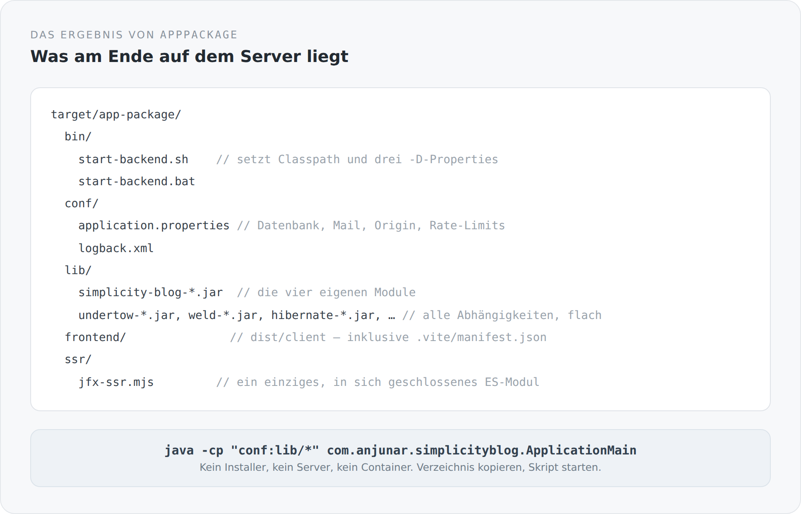

Eine Architektur kann man daran messen, was am Ende ausgeliefert wird. Nicht daran, wie das Projekt im Editor aussieht, sondern daran, was auf einer Maschine landet, die den Quelltext nie gesehen hat.

Bei diesem Blog ist das ein Verzeichnis.

```powershell
sbtn "project simplicity-blog-backend; appPackage"
```

## Was entsteht

{width=720}

Fünf Verzeichnisse. Die vier eigenen JARs und alle Abhängigkeiten flach in `lib`. Konfiguration in `conf`. Das gebaute Frontend in `frontend`. Das SSR-Bundle als eine einzige Datei in `ssr`. Zwei Startskripte in `bin`.

Kein Installer. Kein Applikationsserver, in den etwas hineingelegt wird. Kein Image, das eine Laufzeitumgebung mitbringt. Kopieren, starten.

## Der Task, der das macht

Der interessante Teil von `appPackage` ist nicht, dass er Dateien kopiert, sondern woher er weiß, welche:

```scala
val applicationJar = fileConverterInstance.toPath((Compile / packageBin).value).toFile
val restJar        = fileConverterInstance.toPath((rest / Compile / packageBin).value).toFile
val domainJar      = fileConverterInstance.toPath((domain / Compile / packageBin).value).toFile
val systemJar      = fileConverterInstance.toPath((system / Compile / packageBin).value).toFile

val dependencyJars = (Runtime / externalDependencyClasspath).value
  .map(_.data)
  .map(ref => fileConverterInstance.toPath(ref).toFile)
  .filter(_.isFile)
  .distinct

val frontendDist = frontendBuild.value
val graalBundle  = graalSsrBundle.value
```

Sechs Werte, sechs Abhängigkeiten. Der Task sagt nirgends „baue jetzt das Frontend". Er sagt „ich brauche `frontendBuild`", und sbt kümmert sich um den Rest. Genauso bei den Abhängigkeiten: Sie werden nicht aufgelistet, sondern aus dem Runtime-Classpath abgeleitet. Wenn ich morgen eine Bibliothek in der `build.sbt` ergänze, landet sie im Paket, ohne dass ich das Packaging anfasse.

Das ist derselbe Gedanke wie bei den Modulen. Ich beschreibe Abhängigkeiten, nicht Schritte.

## Das Startskript

```sh
#!/usr/bin/env sh
set -eu
SCRIPT_DIR="$(CDPATH= cd -- "$(dirname -- "$0")" && pwd)"
APP_HOME="$(CDPATH= cd -- "$SCRIPT_DIR/.." && pwd)"
CLASSPATH="$APP_HOME/conf:$APP_HOME/lib/*"
exec java --enable-native-access=ALL-UNNAMED -XX:+EnableJVMCI \
  -Dserver.static.path="$APP_HOME/frontend" \
  -Dserver.ssr.bundle="$APP_HOME/ssr/jfx-ssr.mjs" \
  -cp "$CLASSPATH" com.anjunar.simplicityblog.ApplicationMain "$@"
```

Sieben Zeilen, und man kann sie ganz lesen.

`conf` liegt vor `lib` im Classpath, damit die mitgelieferte `application.properties` gefunden wird, bevor irgendein JAR eine eigene mitbringt. Die zwei `-D`-Properties zeigen auf die beiden Verzeichnisse, die kein Java-Code erraten kann: wo das Frontend liegt und wo das SSR-Bundle liegt. Die JVM-Flags sind dieselben wie im Entwicklungsmodus, aus denselben Gründen.

Es gibt eine Windows-Variante desselben Skripts. Beide werden vom Build geschrieben, nicht von Hand gepflegt — damit sie nicht auseinanderlaufen können.

## Wo die Konfiguration wirklich herkommt

Im Paket liegt eine `application.properties`, aber sie ist nur der unterste Layer. Für den Betrieb zählen vor allem drei Einstellungen, und sie stehen auch im README:

`server.public.origin` ist die von außen sichtbare HTTPS-Adresse. Sie ist keine Kosmetik: Canonical-Links, die Sitemap, der Atom-Feed und die Links in Passwort-Reset-Mails werden daraus gebaut. Steht dort der falsche Wert, sind alle absoluten URLs falsch, und das merkt man erst an den Suchergebnissen.

`server.proxy.trust-forwarded-headers` bleibt aus, solange die Anwendung nicht ausschließlich hinter einem vertrauenswürdigen Reverse-Proxy erreichbar ist. Angeschaltet bestimmt der erste `X-Forwarded-For`-Wert, wer für Rate-Limits als Client gilt. Das ist genau die Art von Schalter, die man nicht aus Bequemlichkeit anschaltet.

`mail.enabled` ist aus, bis SMTP wirklich konfiguriert ist. Ein System mit Registrierung und Passwort-Reset, das stumm keine Mails verschickt, ist schlimmer als eines, das den Fehler zeigt.

## Was das Paket bewusst nicht ist

Es ist kein Docker-Image. Man kann eins daraus bauen, und das wäre auch der wahrscheinliche nächste Schritt — aber das Paket selbst setzt keine Container-Laufzeit voraus.

Es ist kein Fat-JAR. Die Abhängigkeiten liegen einzeln in `lib`. Das ist etwas unmoderner, dafür sieht man, was drin ist, und man kann eine einzelne Bibliothek austauschen, ohne alles neu zu bauen.

Und es ist kein Deployment-Artefakt für einen Applikationsserver. Es gibt kein WAR, weil es keinen Server gibt, der es aufnehmen könnte.

## Ein Detail, das mir wichtig ist

Am Ende des Tasks stehen zwei Log-Zeilen:

```scala
log.info(s"Application package created at ${packageRoot.getAbsolutePath}")
log.info(s"Copied ${dependencyJars.size + 4} backend jars and ${frontendFileCount} frontend files")
```

Der Build sagt, was er getan hat, und in welchem Umfang. Wenn die Zahl der Frontend-Dateien plötzlich bei null liegt, sieht man das im Log, bevor man das Paket auf einen Server kopiert.

Das ist eine kleine Sache. Aber der Unterschied zwischen einem Build, der schweigt, und einem, der sagt, was er produziert hat, ist derselbe wie zwischen einem System, das läuft, und einem, dem man ansieht, ob es läuft.

## Damit steht das Fundament

Bis hierhin ging es um die äußere Form: ein Build, eine Laufzeit, ein Entwicklungsmodus, ein Paket. Nichts davon hat mit Blogs zu tun. Es ist die Antwort auf die Frage, was dieses Projekt überhaupt ist.

Ab dem nächsten Artikel geht es nach innen. Zuerst in das Modul, das ganz unten liegt und keine Fachlichkeit kennen darf — und in dem trotzdem die meisten Entscheidungen stecken, die man später überall spürt.
