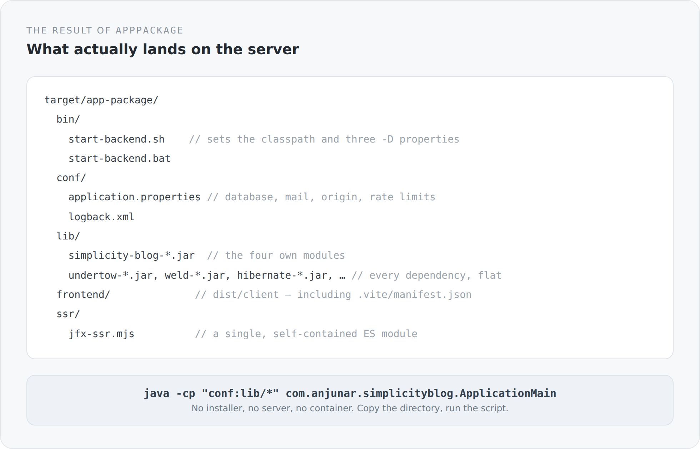

You can measure an architecture by what finally ships. Not by how the project looks in an editor, but by what lands on a machine that has never seen the source.

For this blog that is a directory.

```powershell
sbtn "project simplicity-blog-backend; appPackage"
```

## What comes out

{width=720}

Five directories. The four own JARs and every dependency, flat, in `lib`. Configuration in `conf`. The built frontend in `frontend`. The SSR bundle as a single file in `ssr`. Two start scripts in `bin`.

No installer. No application server to place something into. No image that brings its own runtime. Copy, start.

## The task that does it

The interesting part of `appPackage` is not that it copies files, but how it knows which ones:

```scala
val applicationJar = fileConverterInstance.toPath((Compile / packageBin).value).toFile
val restJar        = fileConverterInstance.toPath((rest / Compile / packageBin).value).toFile
val domainJar      = fileConverterInstance.toPath((domain / Compile / packageBin).value).toFile
val systemJar      = fileConverterInstance.toPath((system / Compile / packageBin).value).toFile

val dependencyJars = (Runtime / externalDependencyClasspath).value
  .map(_.data)
  .map(ref => fileConverterInstance.toPath(ref).toFile)
  .filter(_.isFile)
  .distinct

val frontendDist = frontendBuild.value
val graalBundle  = graalSsrBundle.value
```

Six values, six dependencies. Nowhere does the task say "now build the frontend". It says "I need `frontendBuild`", and sbt takes care of the rest. The same for the dependencies: they are not listed but derived from the runtime classpath. If I add a library to `build.sbt` tomorrow, it ends up in the package without me touching the packaging.

That is the same idea as with the modules. I describe dependencies, not steps.

## The start script

```sh
#!/usr/bin/env sh
set -eu
SCRIPT_DIR="$(CDPATH= cd -- "$(dirname -- "$0")" && pwd)"
APP_HOME="$(CDPATH= cd -- "$SCRIPT_DIR/.." && pwd)"
CLASSPATH="$APP_HOME/conf:$APP_HOME/lib/*"
exec java --enable-native-access=ALL-UNNAMED -XX:+EnableJVMCI \
  -Dserver.static.path="$APP_HOME/frontend" \
  -Dserver.ssr.bundle="$APP_HOME/ssr/jfx-ssr.mjs" \
  -cp "$CLASSPATH" com.anjunar.simplicityblog.ApplicationMain "$@"
```

Seven lines, and you can read all of them.

`conf` comes before `lib` on the classpath, so the bundled `application.properties` is found before any JAR brings one of its own. The two `-D` properties point at the two directories no Java code can guess: where the frontend is and where the SSR bundle is. The JVM flags are the same as in development mode, for the same reasons.

There is a Windows variant of the same script. Both are written by the build, not maintained by hand — so they cannot drift apart.

## Where configuration really comes from

The package contains an `application.properties`, but it is only the bottom layer. For operations three settings matter above all, and they are in the README too.

`server.public.origin` is the externally visible HTTPS address. It is not cosmetic: canonical links, the sitemap, the Atom feed and the links in password-reset mails are built from it. Put the wrong value there and every absolute URL is wrong, and you notice only in the search results.

`server.proxy.trust-forwarded-headers` stays off as long as the application is not reachable exclusively behind a trusted reverse proxy. Switched on, the first `X-Forwarded-For` value decides who counts as the client for rate limits. That is exactly the kind of switch you do not flip for convenience.

`mail.enabled` is off until SMTP is really configured. A system with registration and password reset that silently sends no mail is worse than one that shows the error.

## What the package deliberately is not

It is not a Docker image. You can build one from it, and that would be the likely next step — but the package itself assumes no container runtime.

It is not a fat JAR. The dependencies sit individually in `lib`. That is slightly old-fashioned, and in exchange you can see what is in there and swap a single library without rebuilding everything.

And it is not a deployment artifact for an application server. There is no WAR, because there is no server that could take it.

## One detail that matters to me

At the end of the task there are two log lines:

```scala
log.info(s"Application package created at ${packageRoot.getAbsolutePath}")
log.info(s"Copied ${dependencyJars.size + 4} backend jars and ${frontendFileCount} frontend files")
```

The build says what it did, and how much of it. If the number of frontend files suddenly reads zero, you see that in the log before copying the package onto a server.

That is a small thing. But the difference between a build that stays silent and one that says what it produced is the same as the difference between a system that runs and one you can tell is running.

## That is the foundation

Up to here it has been about the outer form: one build, one runtime, one development mode, one package. None of it has anything to do with blogs. It is the answer to the question of what this project actually is.

From the next article on we go inwards. First into the module that sits at the very bottom and is not allowed to know any business logic — and which nevertheless holds most of the decisions you feel everywhere later.
