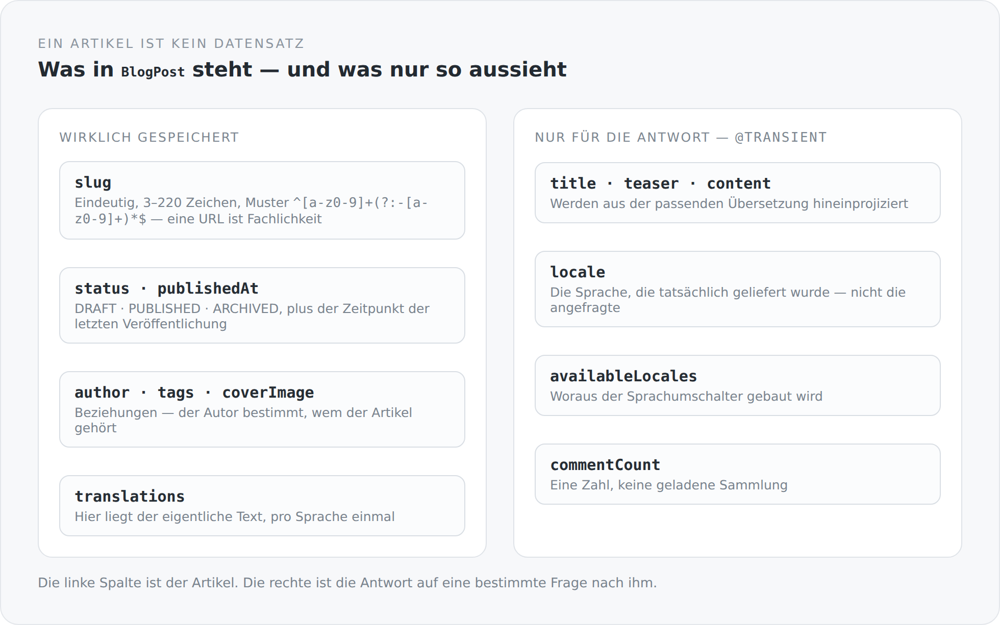

Ein Artikel ist das Einfachste, was ein Blog hat. Titel, Text, Datum, fertig. Genau deshalb ist es die Klasse, an der man am besten sehen kann, ob ein Modell fachlich denkt oder nur speichert.

## Der Slug ist keine Technik

```scala
@JsonbProperty
@NotBlank
@Size(min = 3, max = 220)
@Pattern(regexp = "^[a-z0-9]+(?:-[a-z0-9]+)*$")
@Column(nullable = false, unique = true, length = 220)
var slug: String = uninitialized
```

Vier Zusicherungen an einem Feld, das viele Systeme aus dem Titel generieren und danach nie wieder anfassen.

Ich halte das für falsch. Der Slug ist die Adresse eines Artikels im Netz. Er steht in fremden Lesezeichen, in Suchergebnissen, in verschickten Links. Er ist die einzige Eigenschaft eines Artikels, deren Änderung die Arbeit anderer Leute kaputtmacht.

Deshalb ist er hier ein eigenes, validiertes, eindeutiges Feld. Kleinbuchstaben, Ziffern, Bindestriche zwischen Segmenten, keine führenden oder doppelten Bindestriche — das Muster erlaubt genau das, was in einer URL gut aussieht und in zehn Jahren noch funktioniert.

Und er hängt am Artikel, nicht an der Übersetzung. Ein Artikel hat eine Adresse, egal in wie vielen Sprachen er existiert. In der Übersetzung liegt noch ein Feld `legacySlug` mit einem Kommentar, der sagt, dass es nur da ist, um bestehende Inhalte während der Migration auflösen zu können. Das ist eine Altlast mit Verfallsdatum — und sie ist als solche gekennzeichnet.

## Was gespeichert wird und was nur so aussieht

{width=720}

Die interessantesten Felder der Klasse sind die, die es in der Datenbank nicht gibt:

```scala
@Transient @JsonbProperty @JsonbGraphProperty(transitive = true)
var title: String = uninitialized

@Transient @JsonbProperty @JsonbGraphProperty(transitive = true)
var content: LexicalDocument = uninitialized

@Transient @JsonbProperty
var locale: String = BlogPost.DefaultLocale
```

Titel, Teaser und Inhalt liegen nicht am Artikel, sondern an seinen Übersetzungen. Was hier steht, ist eine Projektion: das Ergebnis der Frage „gib mir diesen Artikel auf Deutsch".

Das ist eine bewusste Doppelnatur. `BlogPost` ist gleichzeitig die Entität, die persistiert wird, und die Sicht, die geliefert wird. Man könnte das trennen — Entität hier, DTO dort, ein Mapper dazwischen. Ich habe es nicht getan, weil die Trennung an dieser Stelle mehr Code als Klarheit gebracht hätte: Es wäre ein DTO gewesen, das fast genauso aussieht wie die Entität, plus eine Übersetzungsschicht, die man bei jeder Änderung mitpflegt.

Der Preis ist, dass man den Unterschied kennen muss. `@Transient` ist hier nicht Technik, sondern eine Aussage: Dieses Feld gehört nicht dem Artikel, es gehört der Antwort.

## Der Lebenszyklus ist eine eigene Datei

```scala
object BlogPostLifecycle {
  def applyBeforeWrite(post: BlogPost, now: LocalDateTime = LocalDateTime.now()): Unit = {
    if (post == null || post.status == null)
      throw IllegalArgumentException("Post status is required")
    if (post.status == BlogPostStatus.PUBLISHED &&
        (post.isNew() || post.statusBeforeWrite != BlogPostStatus.PUBLISHED || post.publishedAt == null)) {
      post.publishedAt = now
    }
  }
}
```

Sechs Zeilen, die eine fachliche Frage beantworten: Wann bekommt ein Artikel ein Veröffentlichungsdatum?

Antwort: Wenn er auf `PUBLISHED` steht und vorher nicht auf `PUBLISHED` stand. Also beim ersten Veröffentlichen und beim erneuten Veröffentlichen nach einer Depublikation — aber nicht bei jeder Speicherung eines bereits veröffentlichten Artikels. Ein Tippfehler, den ich in einem alten Artikel korrigiere, schiebt ihn nicht in der Zeitleiste nach oben.

Damit das funktioniert, muss die Klasse wissen, was ihr Status *vorher* war:

```scala
@PostLoad
def rememberLoadedStatus(): Unit = {
  loadedStatus = status
  loadedCoverImageId = Option(coverImage).map(_.id).orNull
}
```

Ein JPA-Callback, der beim Laden den alten Zustand merkt. Das ist die kleinste mögliche Form von Änderungserkennung, und sie liegt genau dort, wo sie hingehört: an der Entität, nicht in einem Service, der sich den Zustand vorher irgendwo hinlegt.

Dass `applyBeforeWrite` ein reines Objekt mit einem injizierbaren `now` ist, hat einen Grund: `BlogPostLifecycleSpec` kann alle Fälle prüfen, ohne Datenbank, ohne Server und ohne auf die Uhr zu warten.

## Wem gehört ein Artikel

```scala
override def owner(): EntityProvider = author
```

Eine Zeile, die die gesamte Berechtigungslogik dieses Artikels bestimmt. `OwnerProvider` ist ein Interface aus dem JSON-Mapper; `OwnerRule` fragt danach, wenn es entscheidet, ob ein Feld sichtbar oder schreibbar ist.

Im Schema sieht man das an fast jedem Feld:

```scala
val title: Property[BlogPost, String] = property(_.title, classOf[OwnerRule[BlogPost]])
val status: Property[BlogPost, BlogPostStatus] = property(_.status, classOf[OwnerRule[BlogPost]])
val availableLocales: Property[BlogPost, util.List[String]] = property(_.availableLocales)
```

Titel und Status hängen an einer Regel. `availableLocales` nicht — das darf jeder sehen.

Sichtbarkeit ist hier also eine Eigenschaft des Feldes und keine Abfrage im Controller. Wie das im Detail funktioniert, ist ein eigener Artikel in der Staffel über die API.

## Zwei Entity-Graphs

`BlogPost` trägt zwei benannte Entity-Graphs, `BlogPost.list` und `BlogPost.full`. Sie legen fest, was geladen wird: Übersetzungen, Autor, Titelbild, Tags, jeweils mit genau benannten Attributen.

Und hier ist eine ehrliche Schwachstelle. Beide Graphs sind derzeit gleich. Sie laden beide alle Übersetzungen mit vollständigem `content`. Das ist für die Detailseite richtig und für die Übersichtsseite falsch — dort werden Titel, Teaser, Slug, Datum und Autor gebraucht, und stattdessen wandert pro Zeile der komplette Lexical-Baum aller Sprachen über die Leitung.

Die Struktur ist also da: Zwei Graphs, zwei Zwecke, zwei Namen. Nur der Inhalt ist noch derselbe. Das ist genau die Art von halb fertiger Absicht, die man in jedem echten Projekt findet — und die man beim Aufschreiben nicht wegretuschieren sollte.

## Der Tabellenname

```scala
@Table(name = "Blog#Post")
```

Ein `#` im Tabellennamen. Das ist ungewöhnlich, es ist meine Konvention, und es macht aus dem Schema eine Namensraum-Struktur: `Blog#Post`, `Blog#Post#Translation`, `Blog#Post_Tag`. Wer die Datenbank direkt ansieht, erkennt sofort, was zusammengehört.

Es ist keine große Sache. Aber es zeigt eine Haltung, die ich mag: Auch das Datenbankschema ist eine Oberfläche, die jemand liest.

## Was ein Artikel also ist

Nicht eine Zeile in einer Tabelle. Ein Ding mit einer Adresse, einem Besitzer, einem Zustand, einer Geschichte und mehreren sprachlichen Ausprägungen — und mit einer klar markierten Grenze zwischen dem, was es ist, und dem, was man auf eine bestimmte Anfrage hin davon zu sehen bekommt.

Im nächsten Artikel geht es um das Feld, das ich hier ausgespart habe: `content`. Denn ein Text als Zeichenkette zu speichern wäre die naheliegende Lösung gewesen, und sie wäre falsch gewesen.
