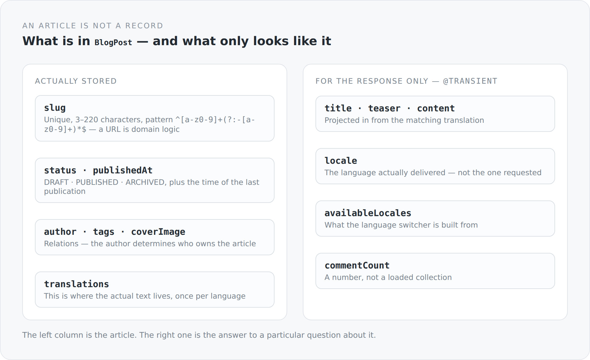

An article is the simplest thing a blog has. Title, text, date, done. Which is exactly why it is the class where you can best see whether a model thinks in domain terms or merely stores.

## The slug is not a technicality

```scala
@JsonbProperty
@NotBlank
@Size(min = 3, max = 220)
@Pattern(regexp = "^[a-z0-9]+(?:-[a-z0-9]+)*$")
@Column(nullable = false, unique = true, length = 220)
var slug: String = uninitialized
```

Four guarantees on a field that many systems generate from the title and then never touch again.

I think that is wrong. The slug is the address of an article on the web. It sits in other people's bookmarks, in search results, in links that were sent around. It is the one property of an article whose change breaks other people's work.

That is why it is a separate, validated, unique field here. Lowercase letters, digits, hyphens between segments, no leading or doubled hyphens — the pattern permits exactly what looks good in a URL and still works in ten years.

And it hangs on the article, not on the translation. An article has one address, no matter how many languages it exists in. The translation still carries a `legacySlug` field with a comment saying it exists only to resolve existing content during migration. That is a legacy with an expiry date — and it is marked as one.

## What is stored and what only looks like it

{width=720}

The most interesting fields of the class are the ones that do not exist in the database:

```scala
@Transient @JsonbProperty @JsonbGraphProperty(transitive = true)
var title: String = uninitialized

@Transient @JsonbProperty @JsonbGraphProperty(transitive = true)
var content: LexicalDocument = uninitialized

@Transient @JsonbProperty
var locale: String = BlogPost.DefaultLocale
```

Title, teaser and content do not live on the article but on its translations. What sits here is a projection: the result of the question "give me this article in German".

That is a deliberate dual nature. `BlogPost` is at the same time the entity that gets persisted and the view that gets delivered. You could separate the two — entity here, DTO there, a mapper in between. I did not, because at this point the separation would have produced more code than clarity: it would have been a DTO looking almost exactly like the entity, plus a translation layer to maintain on every change.

The price is that you have to know the difference. `@Transient` here is not a technicality but a statement: this field does not belong to the article, it belongs to the response.

## The lifecycle is a file of its own

```scala
object BlogPostLifecycle {
  def applyBeforeWrite(post: BlogPost, now: LocalDateTime = LocalDateTime.now()): Unit = {
    if (post == null || post.status == null)
      throw IllegalArgumentException("Post status is required")
    if (post.status == BlogPostStatus.PUBLISHED &&
        (post.isNew() || post.statusBeforeWrite != BlogPostStatus.PUBLISHED || post.publishedAt == null)) {
      post.publishedAt = now
    }
  }
}
```

Six lines answering a domain question: when does an article get a publication date?

Answer: when it is `PUBLISHED` and was not `PUBLISHED` before. So on first publication and on republication after being unpublished — but not on every save of an already published article. A typo I correct in an old article does not push it back to the top of the timeline.

For that to work, the class has to know what its status was *before*:

```scala
@PostLoad
def rememberLoadedStatus(): Unit = {
  loadedStatus = status
  loadedCoverImageId = Option(coverImage).map(_.id).orNull
}
```

A JPA callback that remembers the previous state on load. That is the smallest possible form of change detection, and it sits exactly where it belongs: on the entity, not in a service that stashes the previous state somewhere.

That `applyBeforeWrite` is a pure object with an injectable `now` has a reason: `BlogPostLifecycleSpec` can check every case without a database, without a server, and without waiting for the clock.

## Who owns an article

```scala
override def owner(): EntityProvider = author
```

One line that determines the entire authorization logic of this article. `OwnerProvider` is an interface from the JSON mapper; `OwnerRule` asks it when deciding whether a field is visible or writable.

In the schema you see it on almost every field:

```scala
val title: Property[BlogPost, String] = property(_.title, classOf[OwnerRule[BlogPost]])
val status: Property[BlogPost, BlogPostStatus] = property(_.status, classOf[OwnerRule[BlogPost]])
val availableLocales: Property[BlogPost, util.List[String]] = property(_.availableLocales)
```

Title and status hang on a rule. `availableLocales` does not — everyone may see that.

Visibility is therefore a property of the field and not a check in the controller. How that works in detail is an article of its own in the arc about the API.

## Two entity graphs

`BlogPost` carries two named entity graphs, `BlogPost.list` and `BlogPost.full`. They determine what gets loaded: translations, author, cover image, tags, each with explicitly named attributes.

And here is an honest weak spot. Both graphs are currently identical. Both load every translation with its full `content`. That is right for the detail page and wrong for the listing page — which needs title, teaser, slug, date and author, and instead ships the complete Lexical tree of every language per row.

So the structure is there: two graphs, two purposes, two names. Only the content is still the same. That is exactly the kind of half-finished intention you find in every real project — and that you should not retouch away when writing it up.

## The table name

```scala
@Table(name = "Blog#Post")
```

A `#` in a table name. That is unusual, it is my convention, and it turns the schema into a namespace structure: `Blog#Post`, `Blog#Post#Translation`, `Blog#Post_Tag`. Anyone looking at the database directly can see immediately what belongs together.

It is not a big thing. But it shows an attitude I like: the database schema is a surface somebody reads, too.

## So what an article is

Not a row in a table. A thing with an address, an owner, a state, a history and several linguistic manifestations — with a clearly marked boundary between what it is and what you get to see of it in response to a particular question.

The next article is about the field I left out here: `content`. Storing text as a string would have been the obvious solution, and it would have been wrong.
