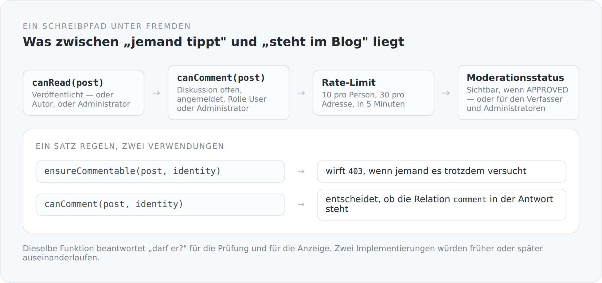

Alles bisher Beschriebene betrifft Daten, die ich selbst anlege. Kommentare sind die einzige Stelle in diesem Blog, an der jemand anderes schreiben darf. Damit sind sie auch die einzige Stelle, an der die Berechtigungsstruktur wirklich unter Druck steht.

## Vier Fragen, eine Datei

```scala
/** One policy shared by direct REST checks and HATEOAS decoration. */
private[blog] object BlogCommentAccess {

  def canRead(post: BlogPost, identity: CurrentIdentity): Boolean =
    post != null && (
      post.status == BlogPostStatus.PUBLISHED ||
        isAdministrator(identity) ||
        owns(post.author, identity))

  def canComment(post: BlogPost, identity: CurrentIdentity): Boolean =
    canRead(post, identity) &&
      post.discussionOpen &&
      identity != null && identity.isAuthenticated &&
      (identity.hasRole("User") || identity.hasRole("Administrator"))

  def canView(status: BlogCommentStatus, owner: User, identity: CurrentIdentity): Boolean =
    status == null || status == BlogCommentStatus.APPROVED ||
      isAdministrator(identity) || owns(owner, identity)

  def canMutate(owner: User, identity: CurrentIdentity): Boolean =
    isAdministrator(identity) || owns(owner, identity)
}
```

Der Kommentar über der ersten Zeile ist die eigentliche Aussage: *One policy shared by direct REST checks and HATEOAS decoration.*

Dieselbe Funktion beantwortet zwei Fragen. Der Controller fragt `ensureCommentable`, bevor er schreibt — und wirft eine `403`, wenn jemand es trotzdem versucht. Die Link-Dekoration fragt `canComment`, um zu entscheiden, ob die Relation `comment` überhaupt in der Antwort steht.

{width=720}

Das ist der Grund, warum es diese Datei gibt. Zwei Implementierungen derselben Regel laufen auseinander — nicht sofort, aber verlässlich. Und wenn sie auseinanderlaufen, gibt es zwei mögliche Fehler: ein Knopf, der eine Fehlermeldung erzeugt, oder ein fehlender Knopf für etwas, das erlaubt wäre. Beides sieht für den Benutzer nach einem kaputten System aus.

## Die Prüfungen selbst sind Sätze

```scala
def ensureReadable(post: BlogPost, identity: CurrentIdentity): Unit = {
  if (post == null) throw new NotFoundException()
  if (!canRead(post, identity)) throw new NotFoundException()
}

def ensureCommentable(post: BlogPost, identity: CurrentIdentity): Unit = {
  ensureReadable(post, identity)
  if (!canComment(post, identity)) throw new ForbiddenException()
}

def ensureCommentBelongsToPost(post: BlogPost, comment: BlogComment): Unit = {
  if (comment == null) throw new NotFoundException()
  if (!post.comments.contains(comment)) throw new BadRequestException("Comment does not belong to this post")
}
```

Ein Detail, das ich für wichtig halte: Ein Entwurf, den man nicht sehen darf, wirft `NotFoundException`, nicht `ForbiddenException`.

Der Unterschied ist nicht Kosmetik. Ein `403` sagt: „Diesen Artikel gibt es, du darfst ihn nur nicht sehen." Das ist eine Information, die jemand sammeln kann. Ein `404` sagt gar nichts.

Beim *Schreiben* ist es dagegen ein `403` — dort weiß der Aufrufer ohnehin schon, dass es das Objekt gibt, weil er es lesen durfte.

Und `ensureCommentBelongsToPost` prüft etwas, das man leicht vergisst: dass die Id im Pfad und die Id im Körper zusammengehören. Ohne diese Prüfung könnte man einen Kommentar an einem Artikel bearbeiten, indem man ihn an einem anderen anfasst.

## Der Rate-Limiter

```scala
@ApplicationScoped
class BlogCommentRateLimiter {
  private val writes = mutable.Map.empty[String, Vector[Instant]]

  @Inject @ConfigProperty(name = "blog.comments.rate-limit.user", defaultValue = "10")
  var maximumPerUser: Int = 10

  @Inject @ConfigProperty(name = "blog.comments.rate-limit.address", defaultValue = "30")
  var maximumPerAddress: Int = 30

  def requireAllowed(userId: String, address: String, now: Instant = Instant.now()): Unit = synchronized {
    if (!consume(s"user:$userId", maximumPerUser, now) ||
        !consume(s"address:$address", maximumPerAddress, now)) {
      throw new StatusException(429, "Too many comment writes; please try again later")
    }
  }

  private def consume(key: String, maximum: Int, now: Instant): Boolean = {
    val window = Duration.ofMinutes(windowMinutes)
    val active = writes.getOrElse(key, Vector.empty)
      .filter(value => Duration.between(value, now).compareTo(window) < 0)
    writes.update(key, if (active.size < maximum) active :+ now else active)
    active.size < maximum
  }
}
```

Ein gleitendes Fenster, zwei Grenzen. Zehn Schreibvorgänge pro Person und dreißig pro Adresse in fünf Minuten.

Zwei Grenzen deshalb, weil sie verschiedene Dinge abfangen. Die Personengrenze schützt vor einem Konto, das zu viel tut. Die Adressgrenze schützt vor jemandem, der sich mehrere Konten anlegt. Beide sind nötig, keine reicht allein.

Der Parameter `now: Instant = Instant.now()` ist wieder das Muster aus dem Lebenszyklus-Artikel: Die Zeit wird hineingereicht, damit `BlogCommentRateLimiterSpec` prüfen kann, was nach vier und was nach sechs Minuten passiert — ohne zu warten.

Und die ehrliche Einschränkung steht im README des Projekts: Die Begrenzer sind prozesslokal. Bei zwei Serverinstanzen hätte jede ihr eigenes Kontingent. Für einen Blog auf einer Maschine ist das in Ordnung, und es steht dort, wo es jemand liest, bevor er horizontal skaliert.

## Wer ist die Adresse

```scala
object ClientAddress
```

Eine eigene kleine Klasse, mit einem eigenen Test. Sie beantwortet die Frage, was „der Client" ist, wenn zwischen ihm und dem Server ein Proxy steht.

Die Antwort hängt an einer Einstellung: `server.proxy.trust-forwarded-headers`. Standardmäßig aus. Erst wenn sie an ist, bestimmt der erste `X-Forwarded-For`-Wert, wer für Rate-Limits als Client gilt.

Der Standard ist richtig herum. Ein Header, den jeder Client selbst setzen kann, darf nicht über ein Rate-Limit entscheiden. Wer den Schalter umlegt, muss dafür sorgen, dass die Anwendung wirklich nur über einen vertrauenswürdigen Proxy erreichbar ist — und genau das steht im README.

## Moderation

`BlogComment` hat einen Status, und die Sichtbarkeit hängt daran:

```scala
def canView(status: BlogCommentStatus, owner: User, identity: CurrentIdentity): Boolean =
  status == null || status == BlogCommentStatus.APPROVED ||
    isAdministrator(identity) || owns(owner, identity)
```

Ein nicht freigegebener Kommentar ist für Administratoren sichtbar und für seinen Verfasser. Das ist wichtiger, als es klingt: Wer etwas schreibt und es danach nicht mehr sieht, schreibt es noch einmal. Und noch einmal.

Dasselbe gilt für die Zählung:

```scala
private def visibleCommentCount(post: BlogPost): Int = {
  if (currentIdentity.hasRole("Administrator")) return post.comments.size()
  math.toIntExact(post.comments.stream().filter(comment =>
    comment.status == null || comment.status == BlogCommentStatus.APPROVED ||
      BlogCommentAccess.owns(comment.user, currentIdentity)).count())
}
```

Die angezeigte Zahl passt zu dem, was man sieht. Eine Übersicht, die „12 Kommentare" behauptet und acht anzeigt, ist ein Fehler, den man nicht sofort bemerkt und der Vertrauen kostet.

Dazu kommt `BlogCommentReport` mit einer Auflösung — eine Meldefunktion. Und `discussionOpen` am Artikel, mit dem sich eine Diskussion schließen lässt, ohne die vorhandenen Kommentare zu löschen.

## Was noch fehlt

Ehrlich, in der Reihenfolge, in der es mich stört.

Es gibt keine Benachrichtigung: Ein gemeldeter Kommentar liegt in der Moderationsansicht, bis jemand nachsieht.

Es gibt keinen Spamschutz jenseits des Rate-Limits. Ein geduldiger Bot mit einem Konto kommt durch.

Und es gibt keine Sperre für Konten. Man kann Kommentare löschen, aber nicht jemanden davon abhalten, neue zu schreiben.

Nichts davon ist dramatisch, solange der Blog lokal läuft. Am Tag der Veröffentlichung wird jeder dieser Punkte konkret.

## Der Gedanke dahinter

Kommentare sind der einzige Ort, an dem dieses System Fremden vertraut. Alles, was hier steht, ist die Antwort auf die Frage, wie viel Vertrauen genau — und die Antwort ist an einer Stelle aufgeschrieben, in einer Datei mit sieben Funktionen.

Das ist mir lieber als eine ausgefeilte Berechtigungsmatrix. Nicht weil es weniger ist, sondern weil man es ganz lesen kann, bevor man es glaubt.

Die nächsten beiden Artikel beschäftigen sich damit, wer diese Fremden überhaupt sind — und wie man das feststellt, ohne ein Geheimnis aufzubewahren.
