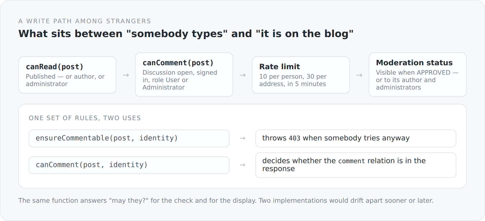

Everything described so far concerns data I create myself. Comments are the only place in this blog where somebody else may write. That makes them the only place where the permission structure really comes under pressure.

## Four questions, one file

```scala
/** One policy shared by direct REST checks and HATEOAS decoration. */
private[blog] object BlogCommentAccess {

  def canRead(post: BlogPost, identity: CurrentIdentity): Boolean =
    post != null && (
      post.status == BlogPostStatus.PUBLISHED ||
        isAdministrator(identity) ||
        owns(post.author, identity))

  def canComment(post: BlogPost, identity: CurrentIdentity): Boolean =
    canRead(post, identity) &&
      post.discussionOpen &&
      identity != null && identity.isAuthenticated &&
      (identity.hasRole("User") || identity.hasRole("Administrator"))

  def canView(status: BlogCommentStatus, owner: User, identity: CurrentIdentity): Boolean =
    status == null || status == BlogCommentStatus.APPROVED ||
      isAdministrator(identity) || owns(owner, identity)

  def canMutate(owner: User, identity: CurrentIdentity): Boolean =
    isAdministrator(identity) || owns(owner, identity)
}
```

The comment above the first line is the actual statement: *One policy shared by direct REST checks and HATEOAS decoration.*

The same function answers two questions. The controller asks `ensureCommentable` before writing — and throws a `403` if somebody tries anyway. The link decoration asks `canComment` to decide whether the `comment` relation appears in the response at all.

{width=720}

That is why this file exists. Two implementations of the same rule drift apart — not immediately, but reliably. And when they drift, there are two possible failures: a button that produces an error message, or a missing button for something that would be allowed. Both look to the user like a broken system.

## The checks themselves are sentences

```scala
def ensureReadable(post: BlogPost, identity: CurrentIdentity): Unit = {
  if (post == null) throw new NotFoundException()
  if (!canRead(post, identity)) throw new NotFoundException()
}

def ensureCommentable(post: BlogPost, identity: CurrentIdentity): Unit = {
  ensureReadable(post, identity)
  if (!canComment(post, identity)) throw new ForbiddenException()
}

def ensureCommentBelongsToPost(post: BlogPost, comment: BlogComment): Unit = {
  if (comment == null) throw new NotFoundException()
  if (!post.comments.contains(comment)) throw new BadRequestException("Comment does not belong to this post")
}
```

One detail I consider important: a draft you are not allowed to see throws `NotFoundException`, not `ForbiddenException`.

The difference is not cosmetic. A `403` says: "this article exists, you are just not allowed to see it." That is information somebody can collect. A `404` says nothing.

When *writing*, on the other hand, it is a `403` — there the caller already knows the object exists, because they were allowed to read it.

And `ensureCommentBelongsToPost` checks something easy to forget: that the id in the path and the id in the body belong together. Without that check you could edit a comment on one article by touching it on another.

## The rate limiter

```scala
@ApplicationScoped
class BlogCommentRateLimiter {
  private val writes = mutable.Map.empty[String, Vector[Instant]]

  @Inject @ConfigProperty(name = "blog.comments.rate-limit.user", defaultValue = "10")
  var maximumPerUser: Int = 10

  @Inject @ConfigProperty(name = "blog.comments.rate-limit.address", defaultValue = "30")
  var maximumPerAddress: Int = 30

  def requireAllowed(userId: String, address: String, now: Instant = Instant.now()): Unit = synchronized {
    if (!consume(s"user:$userId", maximumPerUser, now) ||
        !consume(s"address:$address", maximumPerAddress, now)) {
      throw new StatusException(429, "Too many comment writes; please try again later")
    }
  }

  private def consume(key: String, maximum: Int, now: Instant): Boolean = {
    val window = Duration.ofMinutes(windowMinutes)
    val active = writes.getOrElse(key, Vector.empty)
      .filter(value => Duration.between(value, now).compareTo(window) < 0)
    writes.update(key, if (active.size < maximum) active :+ now else active)
    active.size < maximum
  }
}
```

A sliding window, two limits. Ten writes per person and thirty per address in five minutes.

Two limits because they catch different things. The person limit protects against an account doing too much. The address limit protects against somebody creating several accounts. Both are needed; neither is sufficient alone.

The parameter `now: Instant = Instant.now()` is once again the pattern from the lifecycle article: time is passed in so `BlogCommentRateLimiterSpec` can check what happens after four minutes and after six — without waiting.

And the honest limitation is in the project's README: the limiters are process-local. With two server instances each would have its own quota. For a blog on one machine that is fine, and it is written where somebody reads it before scaling horizontally.

## Who counts as the address

```scala
object ClientAddress
```

A small class of its own, with a test of its own. It answers the question of what "the client" is when a proxy sits between it and the server.

The answer depends on a setting: `server.proxy.trust-forwarded-headers`. Off by default. Only when it is on does the first `X-Forwarded-For` value determine who counts as the client for rate limits.

The default is the right way round. A header any client can set must not decide a rate limit. Whoever flips the switch has to make sure the application really is reachable only through a trusted proxy — and that is exactly what the README says.

## Moderation

`BlogComment` has a status, and visibility hangs on it:

```scala
def canView(status: BlogCommentStatus, owner: User, identity: CurrentIdentity): Boolean =
  status == null || status == BlogCommentStatus.APPROVED ||
    isAdministrator(identity) || owns(owner, identity)
```

A comment that has not been approved is visible to administrators and to its author. That matters more than it sounds: somebody who writes something and then cannot see it writes it again. And again.

The same applies to the count:

```scala
private def visibleCommentCount(post: BlogPost): Int = {
  if (currentIdentity.hasRole("Administrator")) return post.comments.size()
  math.toIntExact(post.comments.stream().filter(comment =>
    comment.status == null || comment.status == BlogCommentStatus.APPROVED ||
      BlogCommentAccess.owns(comment.user, currentIdentity)).count())
}
```

The displayed number matches what you see. A listing claiming "12 comments" and showing eight is a failure you do not notice immediately and that costs trust.

Alongside that there is `BlogCommentReport` with a resolution — a reporting function. And `discussionOpen` on the article, which closes a discussion without deleting the existing comments.

## What is still missing

Honestly, in the order it bothers me.

There is no notification: a reported comment sits in the moderation view until somebody looks.

There is no spam protection beyond the rate limit. A patient bot with an account gets through.

And there is no way to block an account. You can delete comments, but you cannot stop somebody from writing new ones.

None of that is dramatic while the blog runs locally. On the day it goes public, every one of those points becomes concrete.

## The thought behind it

Comments are the only place where this system trusts strangers. Everything written here is the answer to the question of how much exactly — and that answer is written down in one place, in a file with seven functions.

I prefer that to an elaborate permission matrix. Not because it is less, but because you can read all of it before believing it.

The next two articles are about who those strangers actually are — and how you establish that without keeping a secret.
